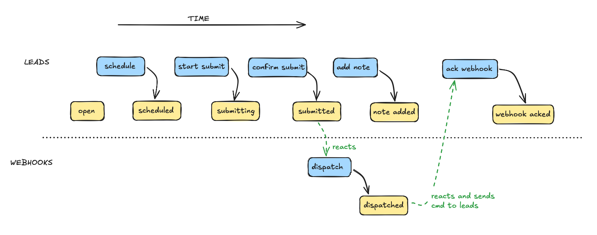

# sourced

**WORK IN PROGRESS**

Event Sourcing / CQRS library for Ruby.
There's many ES gems available already. The objectives here are:
* Cohesive and toy-like DX.
* Eventual consistency by default. Actor-like execution model.
* Built around the [Decide, Evolve, React pattern](https://ismaelcelis.com/posts/decide-evolve-react-pattern-in-ruby/)
* Control concurrency by modeling.
* Simple to operate: it should be as simple to run as most Ruby queuing systems.
* Explore ES as a programming model for Ruby apps.


### The programming model

If you're unfamiliar with Event Sourcing, you can read this first: [Event Sourcing from the ground up, with Ruby examples](https://ismaelcelis.com/posts/event-sourcing-ruby-examples)

The entire behaviour of an event-sourced app is described via **commands**, **events** and **reactions**.


* **Commands** are _intents_ to effect some change in the state of the system. Ex. `Add cart item`, `Place order`, `Update email`, etc.
* **Events** are produced after handling a command and they describe _facts_ or state changes in the system. Ex. 'Item added to cart', 'order placed', 'email updated'. Events are stored and you can use them to build views ("projections"), caches and reports to support UIs, or other artifacts.
* **State** is whatever object you need to hold the current state of a part of the system. It's usually derived from past events, and it's just enough to interrogate the state of the system and make the next decision.

#### Deciders

Deciders are classes that encapsulate loading state from past events and handling commands for a part of your system. They can also define reactions to their own events, or events emitted by other deciders. This is a simple shopping cart decider.

```ruby
class Cart < Sourced::Decider
  # Define what cart state looks like.
  # This is the initial state which will be updated by applying events.
  # The state holds whatever data is relevant to decide how to handle a command.
  # It can be any object you need. A custom class instance, a Hash, an Array, etc.
  CartState = Struct.new(:id, :status, :items) do
    def total = items.sum { |it| it.price * it.quantity }
  end
    
  CartItem = Struct.new(:product_id, :price, :quantity)
    
  # This factory is called to initialise a blank cart.
  state do |id|
    CartState.new(id:, status: 'open', items: [])
  end
  
  # Define a command and its handling logic.
  # The command handler will be passed the current state of the cart,
  # and the command instance itself.
  # Its main job is to validate business rules and decide whether new events
  # can be emitted to update the state
  command :add_item, product_id: String, price: Integer, quantity: Integer do |cart, cmd|
    # Validate that this command can run
    raise "cart is not open!" unless cart.status == 'open'
    # Produce a new event with the same attributes as the command
    event :item_added, cmd.payload
  end
  
  # Define an event handler that will "evolve" the state of the cart by adding an item to it.
  # These handlers are also used to "hydrate" the initial state from Sourced's storage backend
  # when first handling a command
  event :item_added, product_id: String, price: Integer, quantity: Integer do |cart, event|
    cart.items << CartItem.new(**event.payload.to_h)
  end
  
  # Optionally, define how this decider reacts to the event above.
  # .react blocks can dispatch new commands that will be routed to their handlers.
  # This allows you to build workflows.
  # TODO: reacting to own events should provide state?
  react :item_added do |event|
    # Evaluate whether we should dispatch the next command.
    # Here we could fetch some external data or query that might be needed
    # to populate the new commands.
    command :send_admin_email, product_id: event.payload.product_id
  end
  
  # Handle the :send_admin_email dispatched by the reaction above
  command :send_admin_email, product_id: String do |cart, cmd|
    # maybe produce new events
  end
end
```

Using the `CartDecider` in an IRB console. This will use Sourced's in-memory backend by default.

```ruby
cart = Cart.new('test-cart')
cart.state.total # => 0
cmd = cart.add_item(product_id: 'p123', price: 1000, quantity: 2)
cmd.valid? # true
# Inspect state
cart.state.total # 2000
cart.items.items.size # 1
# Inspect that events were stored
cart.seq # 2 the sequence number or "version" in storage. Ie. how many commands / events exist for this cart
cart.events # an array with instances of [Cart::AddItem, Cart::ItemAdded]
cart.events.map(&:type) # ['cart.add_item', 'cart.item_added']
```

Try loading a new cart instance from recorded events

```ruby
cart2 = Cart.load('test-cart')
cart2.seq # 2
cart2.stats.total # 2000
cart2.state.items.size # 1
```


### Extended message syntax

Commands and event structs can also be defined separately as `Sourced::Command` and `Sourced::Event` sub-classes.

These definitions include a message _type_ (for storage) and payload attributes schema, if any.

```ruby
module Carts
  # A command to add an item to the cart
  # Commands may come from HTML forms, so we use Types::Lax to coerce attributes
  AddItem = Sourced::Command.define('carts.add_item') do
    attribute :product_id, Types::Lax::Integer
    attribute :quantity, Types::Lax::Integer.default(1)
    attribute :price, Types::Lax::Integer.default(0)
  end
  
  # An event to track items added to the cart
  # Events are only produced by valid commands, so we don't 
  # need validations or coercions
  ItemAdded = Sourced::Event.define('carts.item_added') do
    attribute :product_id, Integer
    attribute :quantity, Integer
    attribute :price, Integer
  end
  
  ## Now define command and event handlers in a Decider
  class Cart < Sourced::Decider
    # Initial state, etc...
    
    command AddItem do |cart, cmd|
      # logic here
      event ItemAdded, cmd.payload
    end
    
    event ItemAdded do |cart, event|
      cart.items << CartItem.new(**event.payload.to_h)
    end
  end
end
```


### Registering deciders

TODO

```ruby
Sourced::Router.register(Cart)
```


### Running reactions in the background

TODO

### Causation and correlation

TODO


### Projectors

TODO

### Orchestration and choreography

TODO

### Scheduled commands

TODO

### Replaying events

TODO

## Interfaces

TODO

## Setup

You'll need the `pg` and `sequel` gems.

```ruby
gem 'sourced', github: 'ismasan/sourced'
gem 'pg'
gem 'sequel'
```

Create a Postgres database.
For now Sourced uses the Sequel gem. In future there'll be an ActiveRecord adapter with migrations support.

Configure and migrate the database.

```ruby
Sourced.configure do |config|
  config.backend = Sequel.connect(ENV.fetch('DATABASE_URL'))
end

Sourced.config.backend.install unless Sourced.config.backend.installed?
```

Register your Deciders and Reactors.

```ruby
Sourced::Router.register(Leads::Decider)
Sourced::Router.register(Leads::Listings)
Sourced::Router.register(Webooks::Dispatcher)
```

Start background workers.

```ruby
# require your code here
Sourced::Supervisor.start(count: 10) # 10 worker fibers
```


## Control concurrency my modeling the domain

Workers process events and commands by acquiring locks on `[reactor group ID][stream ID]`.

This means that all events for a given reactor/stream are processed in order, but events for different streams can be processed concurrently. You can define workflows where some work is done concurrently by modeling them as a collaboration of streams.



### Custom attribute types and coercions.

Define a module to hold your attribute types using [Plumb](https://github.com/ismasan/plumb)

```ruby
module Types
  include Plumb::Types
  
  # Your own types here.
  CorporateEmail = Email[/^apple@/]
end
```

Then you can use your any built-in Plumb types, as well as your own, when defining command or event structs (or any other data structures for your app).

```ruby
UpdateEmail = Sourced::Command.define('accounts.update_email') do
  attribute :email, Types::CorporateEmail
end
```


## Rails integration

Soon.

## Sourced vs. ActiveJob

ActiveJob is a great way to handle background jobs in Rails. It's simple and easy to use. However, it's not designed for event sourcing.
ActiveJob backends (and other job queues) are optimised for parallel processing of jobs, this means that multiple jobs for the same business entity may be processed in parallel without any ordering guarantees.


Sourced's concurrency model is designed to process events for the same entity in order, while allowing for parallel processing of events for different entities.


## Installation

Install the gem and add to the application's Gemfile by executing:

    $ bundle add sourced

**Note**: this gem is under active development, so you probably want to install from Github:
In your Gemfile:

    $ gem 'sourced', github: 'ismasan/sourced'

## Development

After checking out the repo, run `bin/setup` to install dependencies. Then, run `rake spec` to run the tests. You can also run `bin/console` for an interactive prompt that will allow you to experiment.

To install this gem onto your local machine, run `bundle exec rake install`. To release a new version, update the version number in `version.rb`, and then run `bundle exec rake release`, which will create a git tag for the version, push git commits and the created tag, and push the `.gem` file to [rubygems.org](https://rubygems.org).

## Contributing

Bug reports and pull requests are welcome on GitHub at https://github.com/[USERNAME]/sourced.
