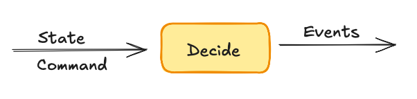
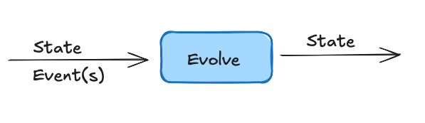
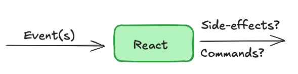

# sourced

**WORK IN PROGRESS**

Event Sourcing / CQRS library for Ruby.
There's many ES gems available already. The objectives here are:
* Cohesive and toy-like DX.
* Eventual consistency by default.
* Built around the [Decide, Evolve, React pattern](https://ismaelcelis.com/posts/decide-evolve-react-pattern-in-ruby/)
* Control concurrency by modeling.
* Explore ES as a programming model for Ruby apps.


## Installation

Install the gem and add to the application's Gemfile by executing:

    $ bundle add sourced

**Note**: this gem is under active development, so you probably want to install from Github:
In your Gemfile:

    $ gem 'sourced', github: 'ismasan/sourced'

## Usage

Define a module to hold your attribute types using [Plumb](https://github.com/ismasan/plumb)

```ruby
module Types
  include Plumb::Types
end
```

### Commands

The entire behaviour of an event-sourced app is described via commands and events.

Commands are _intents_ to effect some change in the state of the system. Ex. `Add cart item`, `Place order`, `Update email`, etc.

```ruby
module Carts
  # A command to add an item to the cart
  # Commands may come from HTML forms, so we use Types::Lax to coerce attributes
  AddItem = Sourced::Command.define('carts.add_item') do
    attribute :product_id, Types::Lax::Integer
    attribute :quantity, Types::Lax::Integer.default(1)
  end
end
```

### Events

Events are produced after handling a command and they describe _facts_ or state changes in the system.

```ruby
module Carts
  # Commands, etc
  
  # An event to track items added to the cart
  # Events are only produced by valid commands, so we don't 
  # need validations or coercions
  ItemAdded = Sourced::Event.define('carts.item_added') do
    attribute :product_id, Integer
    attribute :quantity, Integer
    attribute :price, Integer
  end
end
```

### State

Commands are intents, events are state changes. The "state" itself is whatever object you need to hold the current state of a part of the system.

```ruby
module Carts
  # Commands and events ... etc
  
  # Define what cart state looks like.
  # This is the initial state which will be updated
  # by applying events.
  # The state holds whatever data is relevant to decide how to handle a command.
  # It can be any object you need. A custom class instance, a Hash, an Array, etc.
  CartState = Struct.new(:id, :items) do
    def total = items.sum { |it| it.price + item.quantity }
  end
    
  CartItem = Struct.new(:product_id, :name, :price, :quantity)  
end
```

### Decide

Now define a _Decider_. A Decider is a class that encapsulates handling commands and updating state via events.



```ruby
module Carts
  # commands and events ...
  class Cart < Sourced::Decider
    # Initialize state for this cart.
    # This method is called to retrieve initial
    # state right before handling a command.
    # Past events stored in the backend will be used to
    # update this object so that it represent the current state of a cart.
    def init_state(id)
      CartState.new(id, [])
    end
      
    # Define a .decide method to handle the Carts::AddItem command
    decide AddItem do |state, cmd|
      # Fetch a product from some catalog.
      # Catalog can be a DB table, a file, an API, etc.
      product = Catalog.fetch(cmd.payload.product_id)
      raise "No product for product_id #{cmd.payload.product_id}" unless product
      
      # If the product is available, apply an ItemAdded event to record
      # the fact that an item was added.
      apply(
        ItemAdded, 
        product_id: product.id, 
        name: product.name,
        price: product.price,
        quantity: cmd.payload.quantity
      )
    end
  end
end
```

This gives us an object that can handle a command and return one or more events.

```ruby
cart = Carts::Cart.new('test-cart')
cart.state.total # => 0
add_item = Carts::AddItem.new(stream_id: decider.id, payload: { product_id: 1, quantity: 2 })
events = cart.decide(add_item)
```

### Evolve

A decider's _evolve_ blocks describe how events update the state.



```ruby
module Carts
  # Commands, events ...
  class Cart < Sourced::Decider
    # State, decide method ...
    
    # Define how the Carts::ItemAdded event updates the cart state
    evolve ItemAdded do |state, event|
      state.items << CartItem.new(event.payload.product_id, event.payload.name, ...)
    end
  end
end 
```

With that, handling a valid `Carts::AddItem`command will produce a `Carts::ItemAdded` event, which will update the cart state.

```ruby
cart.state.items # => []
events = cart.decide(add_item)
cart.state.items # => [Carts::Cart::CartItem]
cart.state.total # => some integer
```

### React

TODO



### Registering decider

## Interfaces

TODO

## Setup

Create a Postgres database.
For now Sourced uses the Sequel gem. In future there'll be an ActiveRecord adapter with migrations support.

Configure and migrate the database.

```ruby
Sourced.configure do |config|
  config.backend = Sequel.connect(ENV.fetch('DATABASE_URL'))
end

Sourced.config.backend.install unless Sourced.config.backend.installed?
```

Register your Deciders and Reactors.

```ruby
Sourced::Router.register(Leads::Decider)
Sourced::Router.register(Leads::Listings)
Sourced::Router.register(Webooks::Dispatcher)
```

Start background workers.

```ruby
# require your code here
Sourced::Supervisor.start(count: 10) # 10 worker fibers
```

## Concurrency

Workers process events and commands by acquiring locks on `[reactor group ID][stream ID]`.

This means that all events for a given reactor/stream are processed in order, but events for different streams can be processed concurrently. You can define workflows where some work is done concurrently by modeling them as a collaboration of streams.


## Scheduled commands


## Rails integration

Soon.

## Sourced vs. ActiveJob

ActiveJob is a great way to handle background jobs in Rails. It's simple and easy to use. However, it's not designed for event sourcing.
ActiveJob backends (and other job queues) are optimised for parallel processing of jobs, this means that multiple jobs for the same business entity may be processed in parallel without any ordering guarantees.


Sourced's concurrency model is designed to process events for the same entity in order, while allowing for parallel processing of events for different entities.


## Development

After checking out the repo, run `bin/setup` to install dependencies. Then, run `rake spec` to run the tests. You can also run `bin/console` for an interactive prompt that will allow you to experiment.

To install this gem onto your local machine, run `bundle exec rake install`. To release a new version, update the version number in `version.rb`, and then run `bundle exec rake release`, which will create a git tag for the version, push git commits and the created tag, and push the `.gem` file to [rubygems.org](https://rubygems.org).

## Contributing

Bug reports and pull requests are welcome on GitHub at https://github.com/[USERNAME]/sourced.
