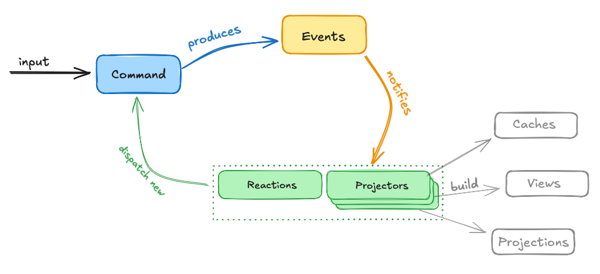
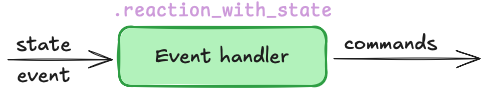
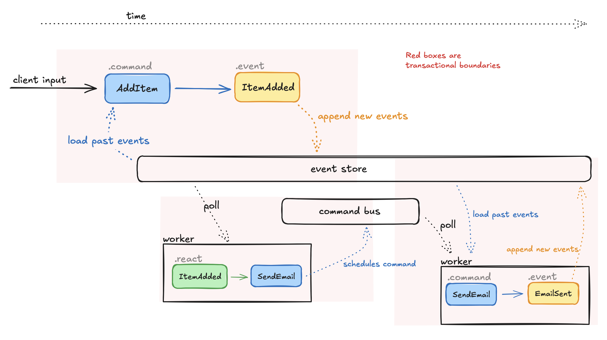

# sourced

**WORK IN PROGRESS**

NOTE: This library is being reworked [in this branch](https://github.com/ismasan/sourced/pull/31)

Event Sourcing / CQRS library for Ruby.
There's many ES gems available already. The objectives here are:
* Cohesive and toy-like DX.
* Eventual consistency by default. Actor-like execution model.
* Built around the [Decide, Evolve, React pattern](https://ismaelcelis.com/posts/decide-evolve-react-pattern-in-ruby/)
* Control concurrency by modeling.
* Simple to operate: it should be as simple to run as most Ruby queuing systems.
* Explore ES as a programming model for Ruby apps.

A small demo app [here](https://github.com/ismasan/sourced_todo)

### The programming model

If you're unfamiliar with Event Sourcing, you can read this first: [Event Sourcing from the ground up, with Ruby examples](https://ismaelcelis.com/posts/event-sourcing-ruby-examples)
For a high-level overview of the mental model, [read this](https://ismaelcelis.com/posts/2025-04-give-it-time/)

The entire behaviour of an event-sourced app is described via **commands**, **events** and **reactions**.



* **Commands** are _intents_ to effect some change in the state of the system. Ex. `Add cart item`, `Place order`, `Update email`, etc.
* **Events** are produced after handling a command and they describe _facts_ or state changes in the system. Ex. `Item added to cart`, `order placed`, `email updated`. Events are stored and you can use them to build views ("projections"), caches and reports to support UIs, or other artifacts.
* **State** is whatever object you need to hold the current state of a part of the system. It's usually derived from past events, and it's just enough to interrogate the state of the system and make the next decision.

### Actors

Actors are classes that encapsulate loading state from past events and handling commands for a part of your system. They can also define reactions to their own events, or events emitted by other actors. This is a simple shopping cart actor.

```ruby
class Cart < Sourced::Actor
  # Define what cart state looks like.
  # This is the initial state which will be updated by applying events.
  # The state holds whatever data is relevant to decide how to handle a command.
  # It can be any object you need. A custom class instance, a Hash, an Array, etc.
  CartState = Struct.new(:id, :status, :items) do
    def total = items.sum { |it| it.price * it.quantity }
  end
    
  CartItem = Struct.new(:product_id, :price, :quantity)
    
  # This factory is called to initialise a blank cart.
  state do |id|
    CartState.new(id:, status: 'open', items: [])
  end
  
  # Define a command and its handling logic.
  # The command handler will be passed the current state of the cart,
  # and the command instance itself.
  # Its main job is to validate business rules and decide whether new events
  # can be emitted to update the state
  command :add_item, product_id: String, price: Integer, quantity: Integer do |cart, cmd|
    # Validate that this command can run
    raise "cart is not open!" unless cart.status == 'open'
    # Produce a new event with the same attributes as the command
    event :item_added, cmd.payload
  end
  
  # Define an event handler that will "evolve" the state of the cart by adding an item to it.
  # These handlers are also used to "hydrate" the initial state from Sourced's storage backend
  # when first handling a command
  event :item_added, product_id: String, price: Integer, quantity: Integer do |cart, event|
    cart.items << CartItem.new(**event.payload.to_h)
  end
  
  # Optionally, define how this actor reacts to the event above.
  # .reaction blocks can dispatch new commands that will be routed to their handlers.
  # This allows you to build workflows.
  reaction :item_added do |event|
    # Evaluate whether we should dispatch the next command.
    # Here we could fetch some external data or query that might be needed
    # to populate the new commands.
    # Here we dispatch a command to the same stream_id present in the event
    stream = stream_for(event)
    stream.command :send_admin_email, product_id: event.payload.product_id
  end
  
  # Handle the :send_admin_email dispatched by the reaction above
  command :send_admin_email, product_id: String do |cart, cmd|
    # maybe produce new events
  end
end
```

Using the `Cart` actor in an IRB console. This will use Sourced's in-memory backend by default.

```ruby
cart = Cart.new('test-cart')
cart.state.total # => 0
cmd = cart.add_item(product_id: 'p123', price: 1000, quantity: 2)
cmd.valid? # true
# Inspect state
cart.state.total # 2000
cart.items.items.size # 1
# Inspect that events were stored
cart.seq # 2 the sequence number or "version" in storage. Ie. how many commands / events exist for this cart
cart.events # an array with instances of [Cart::AddItem, Cart::ItemAdded]
cart.events.map(&:type) # ['cart.add_item', 'cart.item_added']
```

Try loading a new cart instance from recorded events

```ruby
cart2 = Cart.load('test-cart')
cart2.seq # 2
cart2.state.total # 2000
cart2.state.items.size # 1
```

#### Registering actors

Invoking commands directly on an actor instance works in an IRB console or a synchronous-only web handler, but for actors to be available to background workers, and to react to other actor's events, you need to register them.

```ruby
Sourced.register(Cart)
```

This achieves two things:

1. Commands can be routed to this actor by background processes, using its `.handle_command(command)` interface
2. The actor can _react_ to other events in the system (more on event choreography later), via its `.handle_events(events)` interface.

These two properties are what enables asynchronous, eventually-consistent systems in Sourced.

#### Expanded message syntax

Commands and event structs can also be defined separately as `Sourced::Command` and `Sourced::Event` sub-classes.

These definitions include a message _type_ (for storage) and payload attributes schema, if any.

```ruby
module Carts
  # A command to add an item to the cart
  # Commands may come from HTML forms, so we use Types::Lax to coerce attributes
  AddItem = Sourced::Command.define('carts.add_item') do
    attribute :product_id, Types::Lax::Integer
    attribute :quantity, Types::Lax::Integer.default(1)
    attribute :price, Types::Lax::Integer.default(0)
  end
  
  # An event to track items added to the cart
  # Events are only produced by valid commands, so we don't 
  # need validations or coercions
  ItemAdded = Sourced::Event.define('carts.item_added') do
    attribute :product_id, Integer
    attribute :quantity, Integer
    attribute :price, Integer
  end
  
  ## Now define command and event handlers in a Actor
  class Cart < Sourced::Actor
    # Initial state, etc...
    
    command AddItem do |cart, cmd|
      # logic here
      event ItemAdded, cmd.payload
    end
    
    event ItemAdded do |cart, event|
      cart.items << CartItem.new(**event.payload.to_h)
    end
  end
end
```

#### `.command` block

The class-level `.command` block defines a _command handler_. Its job is to take a command (from a user, an automation, etc), validate it, and apply state changes by publishing new events.


```ruby
command AddItem do |cart, cmd|
  # logic here...
  # apply and publish one or more new events
  # using instance-level #event(event_type, **payload)
  event ItemAdded, product_id: cmd.payload.product_id
end
```


#### `.event` block

The class-level `.event` block registers an _event handler_ used to _evolve_ the actor's internal state.

These blocks are used both to load the initial state when handling a command, and to apply new events to the state in command handlers.


```ruby
event ItemAdded do |cart, event|
  cart.items << CartItem.new(**event.payload.to_h)
end
```

These handlers are pure: given the same state and event, they should always update the state in the same exact way. They should never reach out to the outside (API calls, current time, etc), and they should never run validations. They work on events already committed to history, which by definition are assumed to be valid.

#### `.reaction` block

The class-level `.reaction` block registers an event handler that _reacts_ to events already published by this or other Actors.

`.reaction` blocks can dispatch the next command in a workflow with the instance-level `#stream_for` helper.


```ruby
reaction ItemAdded do |event|
  # dispatch the next command to the event's stream_id
  stream_for(event).command(
    CheckInventory, 
    product_id: event.payload.product_id,
    quantity: event.payload.quantity
  )
end
```

The `stream_for` helper lets you choose what stream to dispatch the command to. Stream IDs are just strings, and define concurrency / consistency "tracks" for your events.

The `stream_for` helper also makes sure to copy over causation and correlation IDs from the source event to the new commands.

```ruby
# dispatch a command to a new custom-made stream_id
stream = stream_for("cart-#{Time.now.to_i}")
stream.command CheckInventory, event.payload

# Or use Sourced.new_stream_id
stream_for(Sourced.new_stream_id).command CheckInventory, event.payload

# Or start a new stream and dispatch commands to another actor
stream_for(NotifierActor).command :notify, message: 'hello!'
```

##### `.reaction` block with actor state

If the block to `.reaction`  defines two arguments, this will cause Sourced to load up and yield the Actor's current state by loading and applying past events to it (same as when handling commands).

For this reason,  in this mode `.reaction` can only be used with events that are also registered to _evolve_ the same Actor.



```ruby
# Define an event handler to evolve state
event ItemAdded do |state, event|
  state[:item_count] += 1
end

# Now react to it and check state
reaction ItemAdded do |state, event|
  if state[:item_count] > 30
    stream_for(event).command NotifyBigCart
  end
end
```

##### `.reaction` with state for all events

If the event name or class is omitted, the `.reaction` macro registers reaction handlers for all events already registered for the actor with the `.event` macro, minus events that have specific reaction handlers defined.

```ruby
# wildcard reaction for all evolved events
reaction do |state, event|
  if state[:item_count] > 30
    stream_for(event).command NotifyBigCart
  end
end
```


### Causation and correlation

When a command produces events, or when an event makes a reactor dispatch a new command, the cause-and-effect relationship between these messages is tracked by Sourced in the form of `correlation_id` and `causation_id` properties in each message's metadata.


This helps the system keep a full audit trail of the cause-and-effect behaviour of the entire system.


### Background vs. foreground execution

TODO

### Projectors

Projectors react to events published by actors and update views, search indices, caches, or other representations of current state useful to the app. They can both react to events as they happen in the system, and also "catch up" to past events. Sourced keeps track of where in the global event stream each projector is.

From the outside-in, projectors are classes that implement the _Reactor interface_.

Sourced ships with two ready-to-use projectors, but you can also build your own.

#### State-stored projector

A state-stored projector fetches initial state from storage somewhere (DB, files, API), and then after reacting to events and updating state, it can save it back to the same or different storage.

```ruby
class CartListings < Sourced::Projector::StateStored
  # Fetch listing record from DB, or new one.
  state do |id|
    CartListing.find_or_initialize(id)
  end

  # Evolve listing record from events
  event Carts::ItemAdded do |listing, event|
    listing.total += event.payload.price
  end

  # Sync listing record back to DB
  sync do |listing, _, _|
    listing.save!
  end
end
```

#### Event-sourced projector

An event-sourced projector fetches initial state from past events in the event store, and then after reacting to events and updating state, it can save it to a DB table, a file, etc.

```ruby
class CartListings < Sourced::Projector::EventSourced
  # Initial in-memory state
  state do |id|
    { id:, total: 0 }
  end

  # Evolve listing record from events
  event Carts::ItemAdded do |listing, event|
    listing[:total] += event.payload.price
  end

  # Sync listing record to a file
  sync do |listing, _, _|
    File.write("/listings/#{listing[:id]}.json", JSON.dump(listing)) 
  end
end
```

#### Registering projectors

Like any other _reactor_, projectors need to be registered for background workers to route events to them.

```ruby
# In your app's configuration
Sourced.register(CartListings)
```

#### Reacting to events and scheduling the next command from projectors

Sourced projectors can define `.reaction` handlers that will be called after evolving state via their `.event` handlers, in the same transaction.

This can be useful to implement TODO List patterns where a projector persists projected data, and then reacts to the data update using the data to schedule the next command in a workflow.


```ruby
class ReadyOrders < Sourced::Projector::StateStored
  # Fetch listing record from DB, or new one.
  state do |id|
    OrderListing.find_or_initialize(id)
  end

  event Orders::ItemAdded do |listing, event|
    listing.line_items << event.payload
  end
  
  # Evolve listing record from events
  event Orders::PaymentConfirmed do |listing, event|
    listing.payment_confirmed = true
  end

  event Orders::BuildConfirmed do |listing, event|
    listing.build_confirmed = true
  end
  
  # Sync listing record back to DB
  sync do |listing, _, _|
    listing.save!
  end
  
  # If a listing has both the build and payment confirmed,
  # automate dispatching the next command in the workflow
  reaction do |listing, event|
    if listing.payment_confirmed? && listing.build_confirmed?
      stream_for(event).command Orders::Release, **listing.attributes
    end
  end
end
```

Projectors can also define `.reaction event_class do |state, event|` to react to specific events.

##### Skipping projector reactions when replaying events

When a projector's offsets are reset (so that it starts re-processing events and re- building projections), Sourced skips invoking a projector's `.reaction` handlers. This is because building projections should be deterministic, and rebuilding them should not trigger side-effects such as automation (we don't want to call 3rd party APIs, send emails, or just dispatch the same commands over and over when rebuilding projections).

To do this, Sourced keeps track of each consumer groups' highest acknowledged event sequence. When a consumer group is reset and starts re-processing past events, this sequence number is compared with each event's sequence, which tells us whether the event has been processed before.

## Concurrency model

Concurrency in Sourced is achieved by explicitely _modeling it in_.

Sourced workers process events and commands by acquiring locks on `[reactor group ID][stream ID]`. For example `"CartActor:cart-123"`

This means that all events for a given reactor/stream are processed in order, but events for different streams can be processed concurrently. You can define workflows where some work is done concurrently by modeling them as a collaboration of streams.

#### Single-stream sequential execution

In the following (simplified!) example, a Holiday Booking workflow is modelled as a single stream ("Actor"). The infrastructure makes sure these steps are run sequentially.


The Actor glues its steps together by reacting to events emitted by the previous step, and dispatching the next command.

```ruby
class HolidayBooking < Sourced::Actor
  # State and details omitted...
  
  command :start_booking do |state, cmd|
    event :booking_started
  end
  
  reaction :booking_started do |event|
    stream_for(event).command :book_flight
  end
  
  command :book_flight do |state, cmd|
    event :flght_booked
  end
  
  reaction :flight_booked do |event|
    stream_for(event).command :book_hotel
  end
  
  command :book_hotel do |state, cmd|
    event :hotel_booked
  end
  
  # Define event handlers if you haven't...
  event :booking_started, # ..etc
  event :flight_booked, # ..etc
end
```

#### Multi-stream concurrent execution

In this other example, the same workflow is split into separate streams/actors, so that Flight and Hotel bookings can run concurrently from each other. When completed, they each notify the parent Holiday actor, so the whole process coalesces into a sequential operation again.


TODO: code example.

### Durable workflows

TODO

### Orchestration and choreography

TODO

### Transactional boundaries



The diagram shows the units of work in an example Sourced workflow. The operations within each of the red boxes either succeeds or rolls back the transaction, and it can then be retried or compensated. They are **strongly consistent**. 
The data-flow _between_ these boxes is propagated asynchronously by Sourced's infrastructure so, relative to each other, the entire system is **eventually consistent**.

These transactional boundaries are also guarded by the same locks that enforce the [concurrency model](#concurrency-model), so that for example the same event or command can't be processed twice by the same Actor or Reactor (workflow, projector, etc). 

### Scheduled commands

TODO

### Replaying events

TODO

## Interfaces

TODO

### Testing

TODO

## Setup

You'll need the `pg` and `sequel` gems.

```ruby
gem 'sourced', github: 'ismasan/sourced'
gem 'pg'
gem 'sequel'
```

Create a Postgres database.
For now Sourced uses the Sequel gem. In future there'll be an ActiveRecord adapter with migrations support.

Configure and migrate the database.

```ruby
Sourced.configure do |config|
  config.backend = Sequel.connect(ENV.fetch('DATABASE_URL'))
end

Sourced.config.backend.install unless Sourced.config.backend.installed?
```

Register your Actor's and Reactors.

```ruby
Sourced.register(Leads::Actor)
Sourced.register(Leads::Listings)
Sourced.register(Webooks::Dispatcher)
```

Start background workers.

```ruby
# require your code here
Sourced::Supervisor.start(count: 10) # 10 worker fibers
```

### Custom attribute types and coercions.

Define a module to hold your attribute types using [Plumb](https://github.com/ismasan/plumb)

```ruby
module Types
  include Plumb::Types
  
  # Your own types here.
  CorporateEmail = Email[/@apple\.com^/]
end
```

Then you can use any [built-in Plumb types](https://github.com/ismasan/plumb?tab=readme-ov-file#built-in-types), as well as your own, when defining command or event structs (or any other data structures for your app).

```ruby
UpdateEmail = Sourced::Command.define('accounts.update_email') do
  attribute :email, Types::CorporateEmail
end
```

### Error handling

Sourced workflows are eventually-consistent by default. This means that commands and events are handled in background processes, and any exceptions raised can't be immediatly surfaced back to the user (and, there might not be a user anyway!).

Most "domain errors" in command handlers should be handled by the developer and recorded as domain events, so that the domain can react and/or compensate for them.

To handle true _exceptions_ (code or data bugs, network or IO exceptions) Sourced provides a default error strategy that will "stop" the affected consumer group (the Postgres backend will log the exception and offending message in the `consumer_groups` table).

You can configure the error strategy with retries and exponential backoff, as well as `on_retry` and `on_stop` callbacks.

```ruby
Sourced.configure do |config|
  # config.backend = Sequel.connect(ENV.fetch('DATABASE_URL'))
  config.error_strategy do |s|
    s.retry(
      # Retry up to 3 times
      times: 3,
      # Wait 5 seconds before retrying
      after: 5, 
      # Custom backoff: given after=5, retries in 5, 10 and 15 seconds before stopping
      backoff: ->(retry_after, retry_count) { retry_after * retry_count }
    )
    
    # Trigger this callback on each retry
    s.on_retry do |n, exception, message, later|
      LOGGER.info("Retrying #{n} times")
    end

    # Finally, trigger this callback
    # after all retries have failed and the consumer group is stopped.
    s.on_stop do |exception, message|
      Sentry.capture_exception(exception)
    end
  end
end
```

#### Custom error strategy

You can also configure your own error strategy. It must respond to `#call(exception, message, group)`

```ruby
CUSTOM_STRATEGY = proc do |exception, message, group|
  case exception
  when Faraday::Error
    group.retry(Time.now + 10)
  else
    group.stop(exception)
  end
end

Sourced.configure do |config|
  # Configure backend, etc
  config.error_strategy = CUSTOM_STRATEGY
end
```

### Stopping and starting consumer groups programmatically.

`Sourced.config.backend` provides an API for stopping and starting consumer groups. For example to resume groups that were stopped by raised exceptions, after the error has been corrected.

```ruby
Sourced.config.backend.stop_consumer_group('Carts::Listings')
Sourced.config.backend.start_consumer_group('Carts::Listings')
```

## Rails integration

Soon.

## Sourced vs. ActiveJob

ActiveJob is a great way to handle background jobs in Rails. It's simple and easy to use. However, it's not designed for event sourcing.
ActiveJob backends (and other job queues) are optimised for parallel processing of jobs, this means that multiple jobs for the same business entity may be processed in parallel without any ordering guarantees.


Sourced's concurrency model is designed to process events for the same entity in order, while allowing for parallel processing of events for different entities.


## Installation

Install the gem and add to the application's Gemfile by executing:

    $ bundle add sourced

**Note**: this gem is under active development, so you probably want to install from Github:
In your Gemfile:

    $ gem 'sourced', github: 'ismasan/sourced'

## Development

After checking out the repo, run `bin/setup` to install dependencies. Then, run `rake spec` to run the tests. You can also run `bin/console` for an interactive prompt that will allow you to experiment.

To install this gem onto your local machine, run `bundle exec rake install`. To release a new version, update the version number in `version.rb`, and then run `bundle exec rake release`, which will create a git tag for the version, push git commits and the created tag, and push the `.gem` file to [rubygems.org](https://rubygems.org).

## Contributing

Bug reports and pull requests are welcome on GitHub at https://github.com/ismasan/sourced.	
